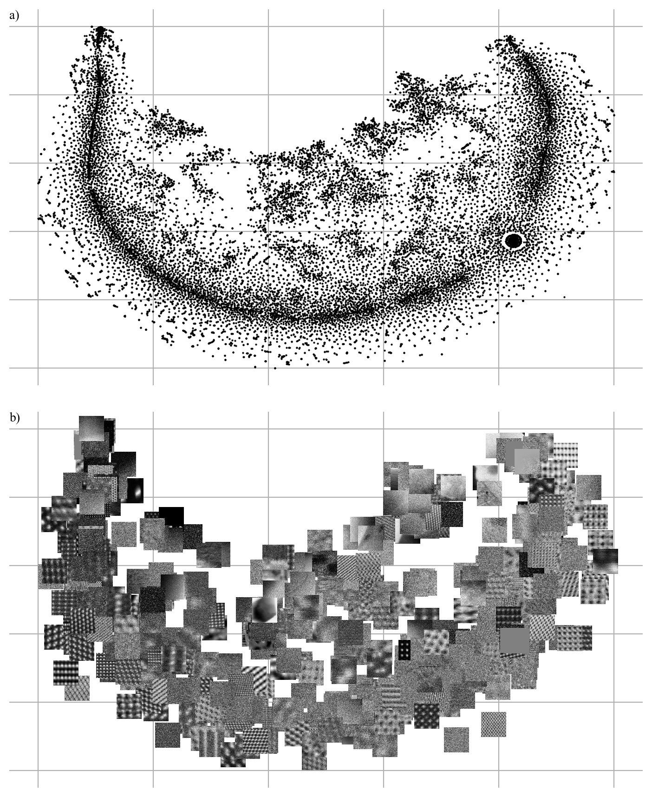

# Warwick Electron Microscopy Datasets

This repository is for the preprint|paper "Warwick Electron Microscopy Datasets". This repository contains scripts used to curate datasets and their variants, and to create both static and interactive visualizations.

There are three main datasets containing 19769 experimental STEM images, 17266 experimental TEM images and 98340 simulated TEM exit wavefunctions. They are available [here](https://warwick.ac.uk/fac/sci/physics/research/condensedmatt/microscopy/research/machinelearning/).

# Interactive Visualizations

Interactive visualizations can be created by running `display_visualization_files.py`. Change values of file location variables to display their visualization:

SAVE_DATA: Full save location of a NumPy file containing a dataset. For example, from the datasets [main page](https://warwick.ac.uk/fac/sci/physics/research/condensedmatt/microscopy/research/machinelearning/).  
SAVE_FILE: Full save location of a NumPy file containing tSNE map points. Files for each visualization are in this repository and have filenames in the form "tsne_*.npy", where * is a wildcard.  

An optional extra parameter, USE_FRAC, controls the portion of data points that are displayed. Use a value lower than 1 if a visualization is slow/unresponsive for a large dataset. 

# Other Contents

There are a few folders:

`create_96x96`: Scripts to downsample examples to 96x96.  
`cropping`: Scripts to crop 512x512 regions from full images.  
`mining_scripts`: An assortment of mining scrips used to curate micrographs.  
`stem_full_shapes`: Scripts to investigate the distribution of STEM full images shapes.

In addition, there are a few noteable fles:

`create_static_displays`: Creates tSNE visualizations with map points and images.  
`create_table_images`: Example TEM and STEM images are selected using their positions in tSNE visualizations.  
`create_visualization_files`: Ouputs [NumPy files](https://docs.scipy.org/doc/numpy/reference/generated/numpy.lib.format.html) containing dataset principal componets and tSNE visualizations.  

# Contact

Jeffrey Ede: j.m.ede@warwick.ac.uk

# Example Visualization

Here is an example visualization for 19769 96x96 crops from STEM images. It's my favorite due to a blot of blank images at the bottom right that's surrounded by halo of noisy images. It was created from images' first 50 [principal components](https://scikit-learn.org/stable/modules/generated/sklearn.decomposition.PCA.html) by using a perplexity of 127.4, 10000 iterations and [scikit-learn defaults](https://scikit-learn.org/stable/modules/generated/sklearn.manifold.TSNE.html) for other parameters.

  

